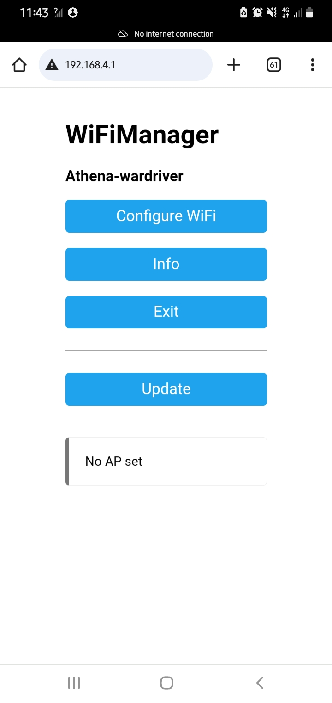
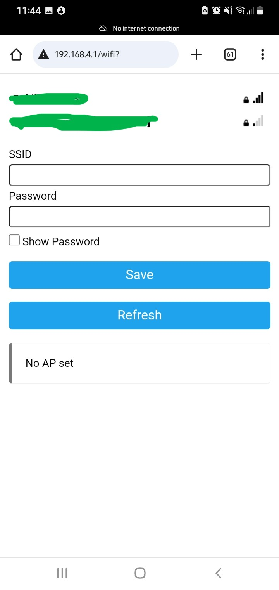
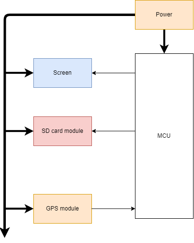
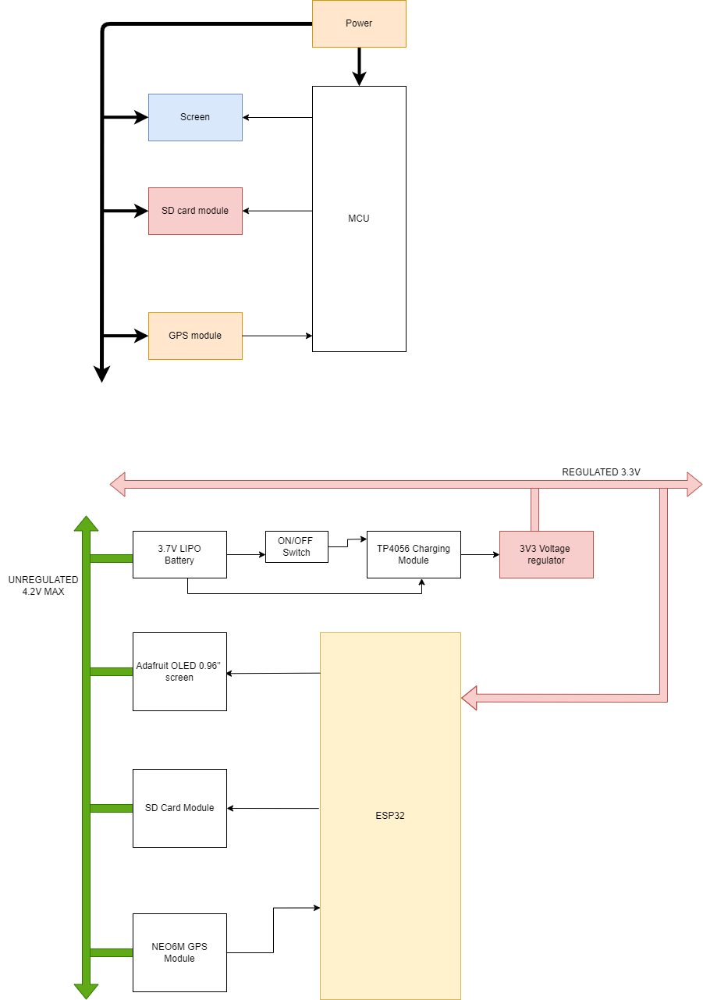

# Athena
A WarDriver spin-off from JosephHewitt's https://github.com/JosephHewitt/


### Initial WIFI connection

Plugging the device into power will boot the device normally. It will expose an IP address: ```(192.168.4.1)``` that you can connect to. This will allow you to enter your WIFI network credentials so that you can download your logged files. 

1. Connect to ```Athena-wardriver``` with password ```12345678```

2. The following screen appears:

   

   3. Select ```Configure WiFi```. The screen below appears. The available WIFI networks will show up. And you'll select the network you wish to connect to, and enter its password. The Device will automatically connect to that network.

      


### Block Diagrams



#### Detailed




### References


