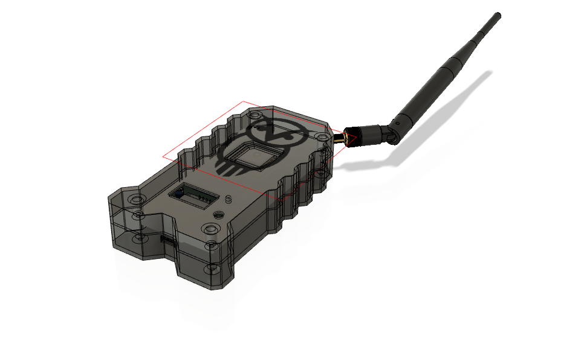

# Athena
A cheap and functional war-driver




## Usage

Wardriving is the act of scanning for WIFI networks and their GPS locations to maybe later exploit them. To do this you need a device to scan the available access points and log them onto some form of memory (file). 

This device does just that. It scans for all available WIFI networks, while at the same time saving their details such as SSID, ENCRYPTION TYPE, CHANNEL, RSSI, MAC-ADDRESSES, LOCATION and TIME-LOGGED. This data is saved onto a micro-sd inside the device

#### Scanning

1. To start scanning, press the ```on/off``` button on the side of the device. The RED LED on the front of the device should start blinking  twice every second. 

2. The GPS takes some time to acquire a satellite fix. Once it does, the GPS LED starts blinking once every second. When you see this happen, press the reset button on the front of the device to restart the logging. The logic is such that immediately the device is turned on, its starts logging, which means it will log networks before acquiring a GPS fix. Resetting the device restarts the logging process afresh with the GPS coordinates available. 
3. Once you are done wardriving, you can open the device, remove the SD card and copy the file labelled ```log.txt``` to your PC for analysis or whatever you want to do with the data. Maybe upload to wigle.net?? The file is in ```CSV``` format for easier manipulation. 

#### Feedback

Tis device includes a screen that shows you the number of networks that have been logged, whether it is scanning and when the scan is done. 


#### Antenna

There is a WIFI antenna attached to the ESP32 inside the device to increase the range at which the device scans for networks.


## Future features

### Automatic file download 

##### Initial WIFI connection

Plugging the device into power will boot the device normally. It will expose an IP address: ```(192.168.4.1)``` that you can connect to. This will allow you to enter your WIFI network credentials so that you can download your logged files. 

1. Connect to ```Athena-wardriver``` with password ```12345678```

2. The following screen appears:

   

   3. Select ```Configure WiFi```. The screen below appears. The available WIFI networks will show up. And you'll select the network you wish to connect to, and enter its password. The Device will automatically connect to that network.

      


### Block Diagrams


#### Detailed


### References


